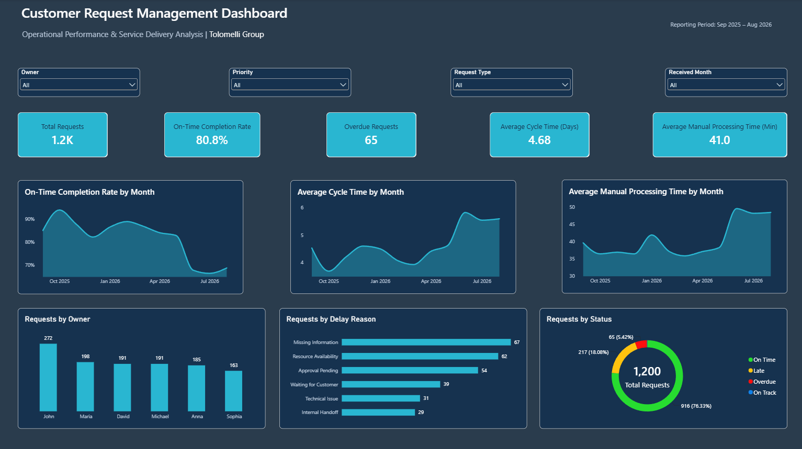

# Customer Request Management Improvement

Independent Business Analysis & Process Improvement Case Study

## Overview

This project analyzes a customer request management process with a focus on delivery performance, workload distribution, processing effort, and operational visibility.

The objective was to identify potential causes of delays and provide management with a clearer way to monitor request status, ownership, priorities, and performance.

The project combines business analysis, process improvement, data analysis, and dashboard development.

## Dashboard

The Power BI dashboard provides an operational view of request performance, including on-time completion, cycle time, manual processing time, workload distribution, and performance trends.

## Key Findings

- Overall on-time completion rate was **66.4%**.
- Average manual processing time was **5.54 hours**.
- Average cycle time was **48.1 hours**.
- On-time performance declined during the final three months analyzed.
- Performance varied across request owners, with one owner showing a noticeable decline during the same period.
- Manual processing effort increased while unresolved work remained in the pipeline.
- Workload distribution was uneven across request owners.

## Analysis Approach

The project began by defining the current request management process and identifying the information needed for better operational visibility.

Business requirements were organized using the MoSCoW method and translated into measurable indicators, including request status, ownership, priority, due dates, completion dates, cycle time, manual processing time, and on-time performance.

The dataset was then analyzed in Excel using calculated fields and pivot-based analysis. The results were validated against Power BI measures before the final dashboard was developed.

The findings were used to identify potential process bottlenecks and support recommendations for a more structured request management process.

## Proposed Improvement

The proposed future-state process focuses on:

- Clear request ownership and status tracking
- Consistent monitoring of due dates and overdue requests
- Better visibility into workload distribution
- Standardized performance metrics
- Reduced dependence on manual reporting
- Centralized management visibility through an operational dashboard

## Project Deliverables

- [Full Case Study](docs/Customer_Request_Management_Case_Study.pdf)
- [Analysis Workbook](data/Tolomelli_Group_Customer_Requests.xlsx)
- [Power BI Dashboard](power-bi/Customer_Request_Management_Dashboard.pbix)
- [Dashboard Preview](assets/Dashboard_PowerBI.png)

## Tools & Methods

**Tools:** Excel, Power BI  
**Methods:** Business Analysis, Process Mapping, Requirements Analysis, MoSCoW Prioritization, KPI Analysis, Root Cause Analysis, Process Improvement

---

*Independent portfolio case study developed to demonstrate practical Business Analysis, Project Management, and Data Analysis skills.*
